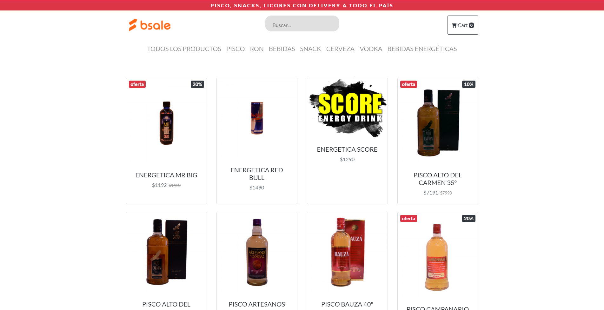

<!--
*** Thanks for checking out the Best-README-Template. If you have a suggestion
*** that would make this better, please fork the repo and create a pull request
*** or simply open an issue with the tag "enhancement".
*** Don't forget to give the project a star!
*** Thanks again! Now go create something AMAZING! :D
-->

<!-- PROJECT SHIELDS -->
<!--
*** I'm using markdown "reference style" links for readability.
*** Reference links are enclosed in brackets [ ] instead of parentheses ( ).
*** See the bottom of this document for the declaration of the reference variables
*** for contributors-url, forks-url, etc. This is an optional, concise syntax you may use.
*** https://www.markdownguide.org/basic-syntax/#reference-style-links
-->

<!-- PROJECT LOGO -->
 

  

  <h3 align="center">Desafio Bsale FrontEnd </h3>

  

Desafío b-sale. Tienda online que despliegue productos agrupados por la categoria a la que pertenecen, generando por separado backend (API REST) y frontend (Aplicación que la consuma)
     
    <a href="https://clever-hawking-a01951.netlify.app/"><strong>Ver Deploy</strong></a>
     
       
  

<!-- ABOUT THE PROJECT -->
## Sobre el proyecto

Ejercicio Construir una tienda online que despliegue productos agrupados por la categoría a la que pertenecen, generando por separado backend (API REST) y frontend (aplicación que la consuma).

Además, hay que agregar un buscador, el cual tiene que estar implementado a nivel de servidor, mediante una Api Rest cuyo lenguaje y framework puede ser de libre elección. Es decir, los datos de productos deben llegar filtrados al cliente.

(<a href="#top">back to top</a>)

### Recursos utilizados en el FrontEnd 

* [Bootstrap 4.6](https://getbootstrap.com/docs/4.6/getting-started/introduction/)
* [JQuery](https://jquery.com/)
* [Bootstrap Icons](https://icons.getbootstrap.com/)
* [axios](https://axios-http.com/docs/intro)

(<a href="#top">back to top</a>)

## Información Adicional
1. Para el envío de la request del cliente, se utiliza la librería axios
2. El buscador de productos opera con el evento onkeyup, lo que significa que a medida que el usuario escribe (al soltar la tecla específicamente) la busqueda de producto(s) se va realizando.
3. Al ingresar a la ruta raíz, una vez construido el DOM se dispara el evento DOMContentLoaded para cargar las primeras funciones del main.js

(<a href="#top">back to top</a>)

